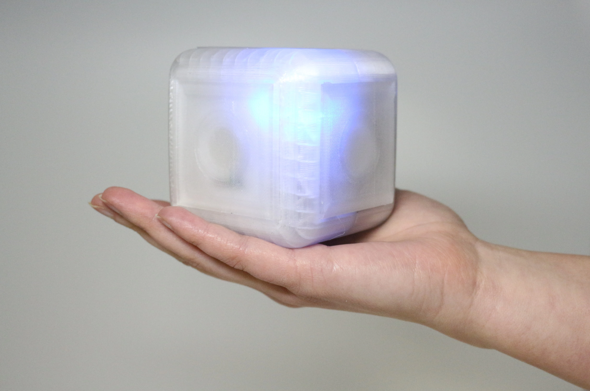

# HAPTICUBES 🧊

## Project
A self-contained 3D-printed cube tangible enabling compliance illusion and friction illusion based on motion-coupled vibrotactile rendering with WIFI control.

## Components
1. [Actuator: HAPCOIL-ONE](https://tactilelabs.com/product/hapcoil-one/)
2. [IMU: BNO085](https://www.adafruit.com/product/4754)
3. [Main MCU: Daisy Seed](https://electro-smith.com/products/daisy-seed)
4. [Class D Amplifier: PAM8302](https://www.adafruit.com/product/2130)
5. [Wifi MCU: Wemos D1 Mini](https://www.wemos.cc/en/latest/d1/d1_mini.html)
6. [Force Sensing Resistors: FSR03](https://www.ohmite.com/catalog/fsr-series/FSR03CE)
7. [Battery management: Powerboost 1000](https://www.adafruit.com/product/2465)
8. [Battery: Generic 3.7v Lipo]

# Wiring 

                           +-----------------------------+
                           |        Daisy Seed MCU       |
                           |                             |
                           |  A0 ──> FSR 1                |
                           |  A1 ──> FSR 2                |
                           |  A2 ──> FSR 3                |
                           |  A3 ──> FSR 4                |
                           |  A4 ──> FSR 5                |
                           |  A5 ──> FSR 6                |
                           |                             |
                           |  SCL1 ─────┐                 |
                           |  SDA1 ─────┘──> BNO085       |
                           |                             |
                           |  TX1 ─────────┐              |
                           |  RX1 ◄────────┘──> Wemos D1  |
                           |                             |
                           |  D0 ──> LED CLK              |
                           |  D1 ──> LED DI               |
                           |                             |
                           |  AUDIO OUT 1 ──> Class D Amp |
                           |                             |
                           |  VIN ─────┬────────┐         |
                           |  DGND ────┘        │         |
                           +-------------------│---------+
                                               │
                              +----------------▼----------------+
                              |        PowerBoost 1000          |
                              |   5V OUT ─────┬──────────────────┐
                              |               │                  │
                              |              GND────────────────┘
                              +---------------┼------------------+
                                              ▼
                                  +---------------------+
                                  |     Wemos D1        |
                                  |   3V3 ◄─────────────┘
                                  |   GND ◄─────────────┘
                                  +---------------------+

                                  +---------------------+
                                  |   Class D Amp       |
                                  |   3V3 ◄─────────────┘
                                  |   GND ◄─────────────┘
                                  +---------------------+

