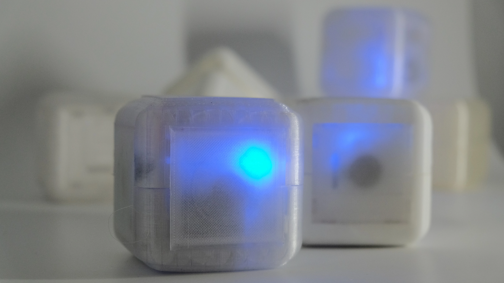

# HAPTICUBES 🧊🧊🧊

## Project
A self-contained 3D-printed cube tangible enabling compliance illusion and friction illusion based on motion-coupled vibrotactile actuation.

## Components
1. [Actuator: HAPCOIL-ONE](https://tactilelabs.com/product/hapcoil-one/)
2. [IMU: BNO085](https://www.adafruit.com/product/4754)
3. [Main MCU: Daisy Seed](https://electro-smith.com/products/daisy-seed)
4. [Class D Amplifier: PAM8302](https://www.adafruit.com/product/2130)
5. [Wifi MCU: Wemos D1 Mini](https://www.wemos.cc/en/latest/d1/d1_mini.html)
6. [Force Sensing Resistors: FSR03](https://www.ohmite.com/catalog/fsr-series/FSR03CE)
7. [Battery management: Powerboost 1000](https://www.adafruit.com/product/2465)
8. [Battery: Generic 3.7v Lipo]
